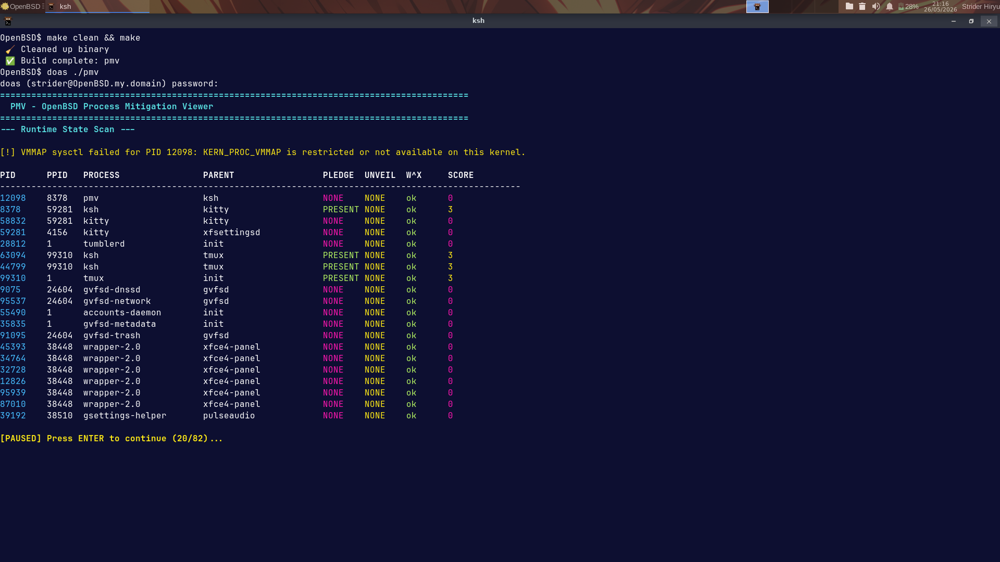
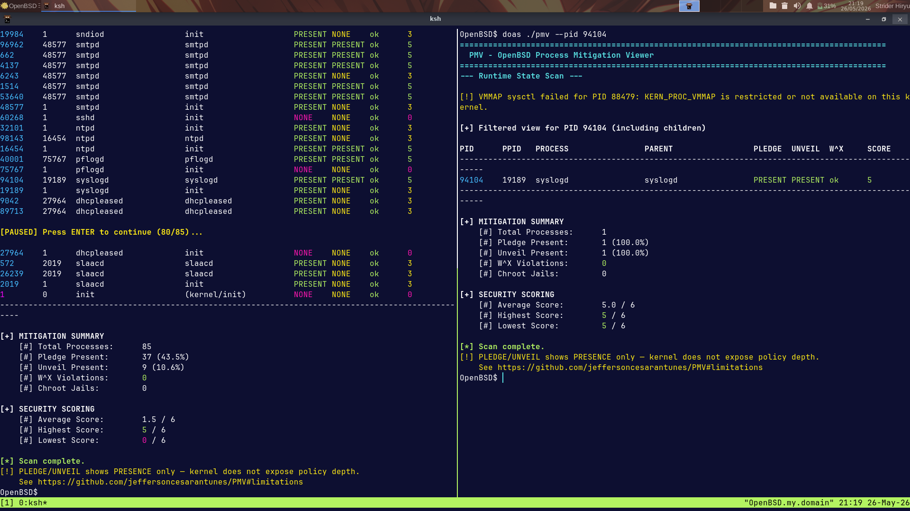
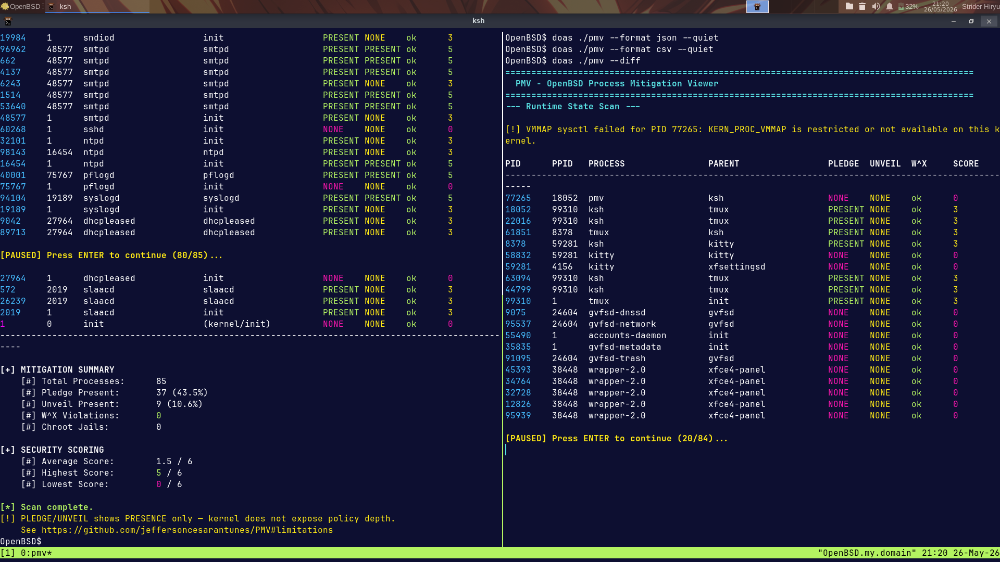

# PMV

Lightweight OpenBSD process mitigation visibility tool — looks at pledge, unveil, and W^X status per process.


[](https://www.openbsd.org)
[](https://gcc.gnu.org/)
[](LICENSE)
[](#-roadmap)
[](https://www.openbsd.org/79.html)
[](./docs/SECURITY_MODEL.md)


---

## Etymology & Origin

**PMV** stands for **P**rocess **M**itigation **V**iewer. The name was deliberate — this is a viewer, not an auditor, not a security scanner, not a vulnerability finder. It shows whether kernel mitigations are present per process and is upfront about what the kernel does and doesn't expose.


---

## Overview

PMV is a minimal utility for inspecting process-level mitigation state on OpenBSD.

It reads kernel-exposed process metadata through `kvm(3)` and `struct kinfo_proc` to check whether active processes use `pledge(2)`, `unveil(2)`, and W^X policy.

All classification comes from kernel-reported state. PMV doesn't do runtime analysis, syscall tracing, or behavioral detection.

Let's be clear about scope: PMV doesn't try to replace `ktrace(1)`, `btrace(8)`, or any other OpenBSD introspection tool. It reads what the kernel exposes and formats it readably. The kernel tells you whether `pledge(2)` and `unveil(2)` were called — not which promises were made or which paths were unveiled. PMV doesn't pretend otherwise. That's a platform constraint, not a missing feature.


---

## Features


* Kernel process table inspection via `libkvm`
* `pledge(2)` state detection (called / not called)
* `unveil(2)` state detection (called / not called)
* W^X-related indicators
* PID filtering (`--pid`) — inspect a single process and its children
* Parent process mapping (PPID) — shows parent PID and process name
* Per-process scoring based on kernel-reported mitigation state
* Self-hardening — PMV applies `pledge(2)` and `unveil(2)` to itself at runtime
* Self-audit — automatic W^X memory verification of its own process on startup
* Structured export (JSON, CSV)
* Diff mode (`--diff`) — compare current state against a previous snapshot
* W^X memory scan (`--scan-wx`) — per-region protection analysis with violation summary
* Built-in help (`--help` / `-h`) — usage reference for all flags


---

## Example Output

```text
PID      PPID   PROCESS                PARENT                 PLEDGE  UNVEIL  W^X     SCORE
-----------------------------------------------------------------------------------------------------
89905    57770  pmv                    ksh                    PRESENT PRESENT ok      5
80996    57770  ksh                    xfce4-terminal         PRESENT NONE    ok      3
96837    1      xfce4-terminal         init                   NONE    NONE    ok      0
<PID>    38074  firefox                firefox                PRESENT NONE    ok      3
18100    <PID>  firefox                firefox                NONE    NONE    ok      0
79750    1      accounts-daemon        init                   NONE    NONE    ok      0
```

*Output reflects kernel-reported mitigation state. `PRESENT` confirms the syscall was called — it does not indicate policy depth or scope.*


---

## How It Works

PMV uses **libkvm** to access the kernel process table in read-only mode. For each process it reads `struct kinfo_proc` and checks:


* Whether `pledge(2)` was called (`p_psflags & PS_PLEDGE`)
* Whether `unveil(2)` was called (`p_psflags & PS_UNVEIL`)
* Whether W^X enforcement is active (`p_psflags & PS_WXNEEDED`)
* Whether the process is chrooted (`p_flag & P_CHROOT`)

**Known limitation:** the kernel only exposes a boolean for pledge and unveil — presence or absence. The specific promises passed to `pledge(2)` or paths passed to `unveil(2)` aren't available. PMV can't report what the kernel doesn't provide.


---

## Security Scoring

Each process gets a score from **-2 to 6** based on what the kernel reports:

| Criteria | Value | Description |
| :------- | :---: | :---------- |
| `pledge(2)` called | **+3** | Syscall restriction active (depth unknown) |
| `unveil(2)` called | **+2** | Filesystem restriction active (scope unknown) |
| `chroot` jail | **+1** | Additional filesystem containment |
| W^X violation (WXNEEDED) | **-2** | Penalty — writable+executable memory pages |

| Score Range | Color | Meaning |
| :---------: | :---: | :------ |
| 4 – 6 | Green | Multiple mitigations detected |
| 1 – 3 | Yellow | Partial mitigation |
| ≤ 0 | Red | No mitigations detected |


---

## System Behavior & Constraints

When you run PMV on a default OpenBSD install, some warnings might pop up. That's normal — it's OpenBSD being defensive.

### 1. Virtual Memory Mapping Restriction

```text
[!] VMMAP sysctl failed for PID XXXXX: KERN_PROC_VMMAP is restricted...
```

**Technical context:** OpenBSD blocks userland from inspecting raw process memory maps (`KERN_PROC_VMMAP`) by default. This prevents local info leaks that could bypass ASLR. If you're in a lab environment and want to test deep memory auditing (`--scan-wx`), you can temporarily allow it:

```bash
doas sysctl kern.allowkmem=1
```

### 2. Mitigation Policy Depth Note

```text
[!] PLEDGE/UNVEIL shows PRESENCE only — kernel does not expose policy depth.
```

**Technical context:** The kernel uses internal bitmask flags in the process structure (`p_psflags`) to track whether a mitigation is active. It doesn't maintain a verbose string array for userland about which paths were unveiled or which promises were requested. `PRESENT` means the binary calls pledge or unveil. That's all the kernel gives us.


---

## Build and Run

```bash
# Clone the repository
git clone https://github.com/jeffersoncesarantunes/PMV.git
cd PMV

# Build
make clean && make

# Run (full system scan)
doas ./pmv

# Show usage reference
doas ./pmv --help

# Filter by PID (show <PID> and its children)
doas ./pmv --pid <PID>

# Structured output
doas ./pmv --format json --quiet
doas ./pmv --format csv --quiet

# Diff mode — compare against previous snapshot
doas ./pmv --diff

# W^X memory scan with per-region detail and violation summary
doas ./pmv --scan-wx <PID>
```

### Generated Artifacts

| File | Description |
| :--- | :---------- |
| `output.json` | Structured export (machine-readable) |
| `output.csv` | Tabular export (spreadsheet-friendly) |
| `.pmv_snapshot` | Internal diff snapshot (auto-generated) |


---

## Project in Action



*Interactive runtime state scan showing the live process table and real-time security scoring.*



*Process filtering with `--pid`, targeting specific subtrees and recalculating scope-specific metrics.*



*Forensic automation: quiet mode (`--quiet`) for data dumping and differential audit (`--diff`) against historical snapshots.*


---

## Operational Integrity

PMV is designed for safe forensic use:


* Read-only kernel access via `libkvm`
* No process interaction or `ptrace(2)` usage
* Self-hardened with `pledge(2)` and `unveil(2)` at runtime
* Graceful handling of restricted entries


---

## Deployment

### Requirements


* OpenBSD (release or -current)
* libkvm
* BSD make
* doas or root privileges

### Privilege Model

PMV needs kernel memory access via `libkvm(3)`, which means elevated privileges. The recommended way to run it is with `doas`. `make install` puts the binary in place **without** setuid root (`-m 755`). This follows OpenBSD's philosophy of explicit privilege elevation rather than implicit setuid escalation. If you want setuid, adjust the mode manually after install.


---

## Repository Structure

```text
├── docs/
│   ├── ARCHITECTURE.md
│   ├── BENCHMARKS.md
│   └── SECURITY_MODEL.md

├── Images/
│   ├── pmv-runtime-scan-v2.png
│   ├── pmv-pid-filter-v2.png
│   └── pmv-diff-audit-v2.png

├── include/
│   └── pmv.h

├── src/
│   ├── engine.c
│   └── main.c

├── .gitignore

├── LICENSE

├── Makefile

├── SECURITY.md

└── README.md
```


---

## Tech Stack


* **Language:** C (C11)
* **Kernel Interface:** libkvm
* **Data Source:** struct kinfo_proc
* **Build Tool:** BSD make
* **Platform:** OpenBSD


---

## Roadmap


* Core mitigation state engine
* `pledge(2)` / `unveil(2)` visibility
* Kernel state extraction via `libkvm(3)`
* JSON/CSV export
* Silent mode (`--quiet` / `-q`)
* PID filtering (`--pid`)
* Parent process mapping (PPID)
* Per-process scoring
* Diff mode (`--diff`) — change detection across runs


---

## Documentation

[](./docs/ARCHITECTURE.md)
[](./docs/SECURITY_MODEL.md)
[](./docs/BENCHMARKS.md)


---

## License

[](./LICENSE)

*This project is licensed under the MIT License.*
